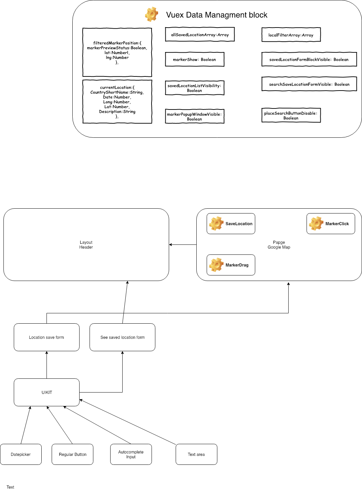

# ToGo

> TO go interactive web app

## Requested packages to run project

``` bash
# install Vue
$ npm i vue -g

# Install NuxtJS
$ npm i nuxt -g

```

## Build Setup

``` bash
# install dependencies
$ npm install

# serve with hot reload at localhost:3000
$ npm run dev

# build for production and launch server
$ npm run build
$ npm start

# generate static project
$ npm run generate
```
## Used technologies

``` bash
SASS ( SCSS ),
nodeJS ( https://nodejs.org/en/ ),
VueJS ( https://vuejs.org/ )
```


## Packages
``` bash
nuxt-sass-resources-loader ( https://www.npmjs.com/package/nuxt-sass-resources-loader ),
NuxtJS ( https://nuxtjs.org/ )( vueJS flexible and scalable framework for web apps ),
Vue Material ( UI material library, official site: https://vuematerial.io ),
Prettier ( Code formatter, official site https://prettier.io/ ),
Font-awesome ( see https://github.com/FortAwesome/vue-fontawesome for its dependencies )
Vue2-google-maps2 ( https://www.npmjs.com/package/vue2-google-maps2 )
```

## Font
``` bash
Roboto Condensed by Christian Robertson
( https://www.1001freefonts.com/designer-christian-robertson-fontlisting )
Fontawesome free-solid-svg-icons by Fonticons, Inc.
(https://github.com/FortAwesome/vue-fontawesome)
```

## Demo
If github doesn't show animation please see in your local environment


## Demo
UML diagram. If you could not see in github try to open UMLduagram.pdf file , which is in core of git
